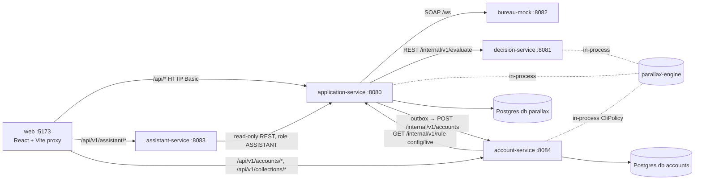

# Parallax — Build Pack v2 (Claude Code)

Sep 25, 2026 · @Teclusion

## How this pack works

This pack builds Parallax end to end with Claude Code: 23 prompts, run in order, one fresh session per prompt, in one repository. Every prompt tells the agent its goal, what already exists, which files to read, the exact contracts to implement, the tests to write, and a Definition of Done it must prove with real command output.

Three things keep the agent from inventing its own design:

1. **The spec lives in the repo.** Prompt 02 writes `docs/SPEC.md` (engine rules, API contracts, data model, UI map). Every later prompt starts by reading it, and any gap gets logged in `docs/DECISIONS.md` rather than guessed.
2. **The UI has a reference.** Your prototype sits at `docs/design/prototype.html`. The web prompts treat it as the source of truth for layout, copy, colours, spacing and behaviour, screen by screen. React components replace the prototype's in-browser simulation with real API calls; nothing else changes.
3. **Every screen is wired to a named endpoint.** The system map below lists each screen, the endpoint it calls, the service that serves it and the tables behind it. The web prompts are forbidden from inventing fields: they read `/v3/api-docs` from the running services.

### What you provide

Before Prompt 01:

- [ ] A Mac with at least 16 GB RAM (the full stack is Postgres, six Spring services and Vite). Apple Silicon is fine.
- [ ] Homebrew, JDK 21, Maven, Node 20+, git, Docker Desktop (setup below).
- [ ] Claude Code installed and signed in.
- [ ] An empty folder `~/code/parallax`.
- [ ] `parallax_prototype.html` saved into that folder as `docs/design/prototype.html` (Prompt 01 checks it exists and stops if it doesn't).
- [ ] This pack exported as PDF and saved as `docs/build-pack/Parallax-Build-Pack-v2.pdf`, for your own reference. The agent never needs it; each prompt is self-contained.

Before Prompt 16 (assistant):

- [ ] An Anthropic API key, exported as `ANTHROPIC_API_KEY`. Everything else builds and tests without one; without it the assistant screen shows a clear “model not configured” state.

Optional, for the job description's Jira/Bitbucket line:

- [ ] A GitHub repo (source of truth, Actions CI).
- [ ] A Bitbucket repo as a push mirror (Pipelines).
- [ ] A free Jira Software board with project key **PX**.

### What you do after each prompt

1. Read the agent's final report. It must show real command output for every Definition of Done item.
2. Run the check command given under each prompt yourself (one line).
3. Confirm the commit exists: `git log --oneline -1`.
4. Close the session and open a fresh one for the next prompt.

## macOS setup (once, before Prompt 01)

```bash
# Toolchain
brew install openjdk@21 maven node git
sudo ln -sfn $(brew --prefix)/opt/openjdk@21/libexec/openjdk.jdk /Library/Java/JavaVirtualMachines/openjdk-21.jdk
echo 'export JAVA_HOME=$(/usr/libexec/java_home -v 21)' >> ~/.zshrc && source ~/.zshrc
java -version      # must print 21
node -v           # must print v20 or later

# Docker Desktop: install from docker.com, then Settings → Resources → Memory ≥ 8 GB
docker version

# Claude Code
npm install -g @anthropic-ai/claude-code
claude --version

# Repository
mkdir -p ~/code/parallax/docs/design ~/code/parallax/docs/build-pack
cp ~/Downloads/parallax_prototype.html ~/code/parallax/docs/design/prototype.html
cd ~/code/parallax && git init -b main
```

Apple Silicon note: Testcontainers works with Docker Desktop out of the box. If a test says it cannot find Docker, run `sudo ln -sf ~/.docker/run/docker.sock /var/run/docker.sock` once.

How to run a prompt: `cd ~/code/parallax && claude`, paste the whole prompt, and let it work. Approve shell commands when asked (or start it with a permission mode you're comfortable with). When the session gets long, tell it to commit, then start a new session with the recovery line from the last section.

## System map: UI → API → service → database



The web app never talks to a database. It calls three services through the Vite dev proxy (no CORS), sending HTTP Basic credentials held in memory. Each service owns its database; the only cross-service writes are the outbox (application → account) and nothing else.

| Screen (route) | Endpoints it calls | Service | Tables behind it |
| --- | --- | --- | --- |
| Marketing site (`/`) | none (static) | web | — |
| Login (`/login`) | `GET /api/v1/me` | application | in-memory users |
| Overview (`/app`) | `GET /api/v1/overview` | application | decision\_ledger, application, rule\_version, drift\_report, shadow\_config |
| New application (`/app/apply`) | `POST /api/v1/applications` (Idempotency-Key), `GET /api/v1/lab/versions/live` | application → bureau-mock, decision-service | application, idempotency\_key, bureau\_pull, decision\_ledger, outbox, shadow\_result |
| Decisions (`/app/decisions`) | `GET /api/v1/applications?outcome=&q=&page=` | application | application, decision\_ledger |
| Decision detail (`/app/decisions/:id`) | `GET /api/v1/applications/{id}`, `GET /api/v1/decisions/{seq}/reproduce`, `GET /api/v1/applications/{id}/adverse-action-notice` | application | application, decision\_ledger, bureau\_pull, rule\_version, shadow\_result |
| Review queue (`/app/queue`) | `GET /api/v1/reviews/queue`, `POST /api/v1/reviews/{id}`, `GET /api/v1/reviews/override-stats` | application | decision\_ledger, application, outbox |
| Strategy Lab (`/app/lab`) | `GET/POST /api/v1/lab/versions`, `PUT …/{v}/config`, `POST …/{v}/replays`, `GET /api/v1/lab/replays/{job}` (+ `/flips`, `/flips/{seq}`), `POST …/{v}/propose`, `…/approve`, `…/reject`, `DELETE …/{v}`, `POST /api/v1/lab/rollback`, `POST …/{v}/shadow`, `GET …/{v}/shadow-results`, `GET /api/v1/lab/versions/compare` | application | rule\_version, replay\_job, replay\_flip, decision\_ledger, loan\_outcome, shadow\_config, shadow\_result |
| Drift monitor (`/app/drift`) | `GET /api/v1/drift/latest`, `POST /api/v1/drift/run`, `POST /api/v1/drift/simulate` | application | drift\_report, decision\_ledger |
| Decision ledger (`/app/ledger`) | `GET /api/v1/ledger`, `GET /api/v1/ledger/stats`, `GET /api/v1/ledger/verify`, `POST /api/v1/ledger/demo/attempt-update`, `POST /api/v1/ledger/demo/tamper-simulation` | application | decision\_ledger |
| Assistant (`/app/assistant`) | `GET /api/v1/assistant/status`, `GET /api/v1/assistant/tools`, `POST /api/v1/assistant/chat` | assistant → application | none of its own (in-memory conversations) |
| System (`/app/system`) | `GET /api/v1/system/status`, `POST /api/v1/system/bureau-fault`, `GET /api/v1/system/idempotency-keys`, `GET /api/v1/system/bureau-pulls` | application → bureau-mock | idempotency\_key, bureau\_pull, application |
| Accounts (`/app/accounts`, `/app/accounts/:id`) | `GET /api/v1/accounts`, `GET /api/v1/accounts/{id}`, `POST …/{id}/simulate-month`, `POST …/{id}/cli-requests` | account | account, statement, card\_transaction, cli\_request |
| Collections (`/app/collections`) | `GET /api/v1/collections/summary`, `GET /api/v1/collections?bucket=`, `POST /api/v1/collections/{id}/actions` | account | account, statement, collection\_action |

The full request and response shapes for every endpoint are written into `docs/SPEC.md` §15 by Prompt 02, and each backend prompt implements its rows exactly.

## Prompt index

Each prompt is its own tab under **Prompts**. Copy the whole tab into a fresh Claude Code session.

| # | Prompt | What it builds | Done when | Your check |
| --- | --- | --- | --- | --- |
| 01 | Repository foundation | Maven multi-module skeleton, Postgres in Docker, CI, AGENTS.md, CLAUDE.md | `./mvnw verify` green, Postgres healthy | `./mvnw -q -B verify` |
| 02 | Spec, contracts, design inventory | `docs/SPEC.md` (rules, data model, every API contract), ADRs, `docs/design/UI-INVENTORY.md` from the prototype | Every section present, no TODOs | `grep -c '^## §' docs/SPEC.md` → 16 |
| 03 | Engine model and config | Records, enums, RuleConfigs v1.2/v1.3, validator | Validator tests green | `./mvnw -q -pl parallax-engine verify` |
| 04 | Decision engine | DecisionEngine, worked examples, property tests, purity rules | Priya 445 / Ishaan 830 pass | same |
| 05 | SOAP bureau | XSD, JAXB, bureau-mock with fault injection | curl returns a PRIME report | `curl` in the prompt |
| 06 | Service foundation | Flyway, DB roles, rule\_version seed, security, `/me`, PII encryption, log masking | Context starts, roles enforced | `./mvnw -q -pl application-service verify` |
| 07 | Intake and idempotency | `POST /applications`, idempotency, bureau client, reuse window, velocity | 200 replay, 409, 422 tests green | same |
| 08 | Decision service and ledger | decision-service, LedgerWriter, LedgerVerifier | 20 parallel inserts verify | same |
| 09 | Decide end to end | Transactional commit, pipeline timings, read APIs, reproduce, adverse action, ledger APIs | curl: APPROVED 830 and DECLINED 445 | curl in the prompt |
| 10 | Resilience | Circuit breaker, retry, re-decision and engine-retry jobs | Outage → REFER → re-decided | same |
| 11 | Review queue and system | Queue, overrides, override stats, system status, fault proxy, key and pull listings | Override row in ledger | same |
| 12 | Synthetic history | data-generator, seed ingest, loan outcomes | 20k seeded, chain verifies | curl `/ledger/verify` |
| 13 | Replay | Replay jobs, report, flips, golden set, measured performance | Report pasted with real timings | same |
| 14 | Governance | Version lifecycle, maker-checker, promote, rollback, compare | v1.4 LIVE via two users | same |
| 15 | Shadow, drift, overview | Shadow mode, PSI with as-of date, drift simulation, overview API | PSI report and overview JSON | same |
| 16 | AI assistant | Read-only security, 7 tools, Anthropic chat, injection guard | Tool registry test, 503 without key | same |
| 17 | MCP, evals, skills | MCP server, 15 evals, skills folder, ai-workflow.md | Evals run if a key exists | same |
| 18 | CLI policy and outbox | Pure CliPolicy, transactional outbox | Approved decision → one event | same |
| 19 | Account service | Accounts, statements, CLI, delinquency, collections | 6 months → CLI approved | curl in the prompt |
| 20 | Web A: shell | Vite app, design tokens from prototype, API layer, auth, marketing site, login, shell | Pages match prototype side by side | `npm run build` |
| 21 | Web B: workspace | Overview, New application, Decisions, Decision detail, Review queue | Submit → detail → reproduce works live | click-through |
| 22 | Web C: strategy and lifecycle | Strategy Lab, Drift, Ledger, Assistant, System, Accounts, Collections | Full lab flow in the browser | click-through |
| 23 | Release | Dockerfiles, full compose, Playwright E2E, README, screenshots, Bitbucket | `docker compose up` from clean works | E2E summary |

You can stop after Prompt 15 with a complete, interview-ready backend. Prompts 16 to 23 add the AI, lifecycle and UI layers. If time runs short, cut 17, then 19, never 08 or 09.

## What changed from v1

| Issue in v1 | Fix in v2 | Where |
| --- | --- | --- |
| Ledger hash broke after a DB round trip (nanosecond `Instant`, jsonb number normalisation) | `created_at` truncated to microseconds before hashing; payload built from parsed values with a fixed canonical serializer; write-read-verify test | 08 |
| Drift and the approval trend used `now()` while seed data is fixed at 2026-09-25 | All windows measured from `parallax.as-of` (default: latest ledger `created_at`) | 02, 12, 15 |
| CLI tenure came from `opened_at`, so simulated months never aged the account | Tenure = number of closed statements; each simulated statement advances a per-account statement clock | 18, 19 |
| ENGINE\_FAILED stored a 503 under the idempotency key forever | Returns 202 `{status: ENGINE_PENDING}`; clients poll `GET /applications/{id}`; the key stores the 202 | 10 |
| Pipeline modal timings were faked | `POST /applications` returns `pipeline[]` with measured per-step milliseconds | 09, 21 |
| Spec example “620 → 640” | Every example uses v1.3's 680 approve cutoff and v1.4 = 700 | 02 |
| Spec said replay diffs recorded outcomes | Baseline = stored inputs re-evaluated under the current LIVE config (like-for-like) | 02, 13 |
| SSN `912345678` labelled near-prime in the prototype | Web builds SSNs from the §8 digit mapping; 912345678 is PRIME | 02, 21 |
| AAN-v1 vs AAN-v2 | Template id `AAN-v2` everywhere | 09 |
| 100k vs 20k | Compose seeds 20k; the 100k run is measured once and published with machine specs | 12, 13, 23 |
| Old working codename in the spec footer | Name check in Prompt 23's consistency pass (the earlier codename must not appear in the shipped repo) | 23 |
| SUBPRIME test SSN left the scenario digit open | Test SSNs pinned: `961234567` (SUBPRIME, NONE), `937123456` (NEAR\_PRIME, ADDRESS\_MISMATCH) | 02, 09 |
| Drift slider in the prototype had no backend | `POST /api/v1/drift/simulate {shift}` generates labelled synthetic applicants | 15, 22 |
| Prototype sidebar had no Accounts or Collections | LIFECYCLE nav section added in the same style | 20, 22 |

## Running the sessions

**Every prompt ends with the same report shape.** If any part is missing, reply with “Complete the Definition of Done report with real command output” before moving on.

```text
REPORT — Prompt NN
1. Files created / changed (paths)
2. Commands run and their real output (last 20 lines each)
3. Tests: counts from Surefire/Failsafe (run, failed, skipped)
4. DECISIONS.md entries added
5. Changes to earlier modules and why
6. Anything not done, and why
```

**If a session runs out of room**, tell it: “Commit what builds with message `PX-NN: wip`.” Then open a new session and paste:

```text
Continue Prompt NN of the Parallax build from the last commit. Read AGENTS.md, docs/SPEC.md and docs/DECISIONS.md first, run `git log --oneline -5` and `./mvnw -q -B verify`, list what Prompt NN still needs, then finish it. Same rules and same Definition of Done.
```

(then paste the original Prompt NN below it).

**If the agent drifts** (invents an endpoint, a field, a library or a number):

```text
Stop. You added <thing>, which is not in docs/SPEC.md or this prompt. Remove it. If you believe it is needed, add one line to docs/DECISIONS.md explaining why and ask me before implementing it.
```

**If the build goes red from an earlier prompt:** fix the red test first, in its own commit (`PX-NN: fix <test>`), before new work. Never let the agent `@Disabled` a test.

**Keep a note for `docs/ai-workflow.md`:** whenever the agent gets something wrong and you or a test catch it, write two lines (what, how caught, commit hash). Prompt 17 needs one real example.
